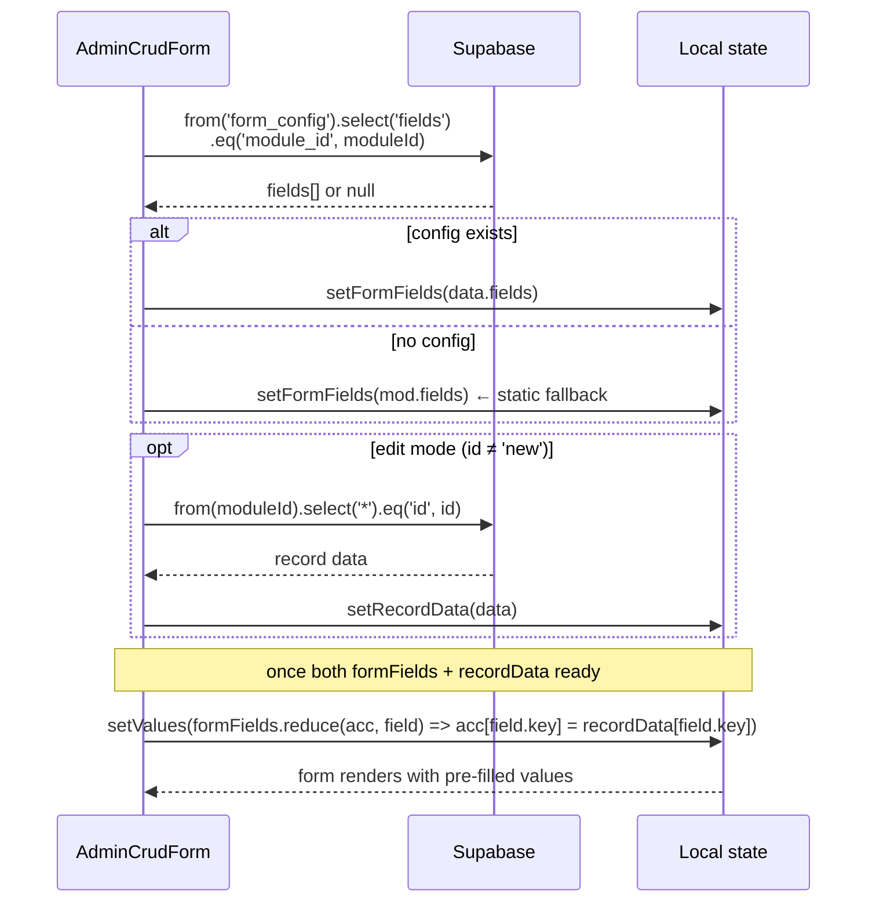

# Dynamic Form Field Config

The **Forms** section in Admin Settings lets you fully customise each module's create/edit form — add new fields, change types, reorder, hide, or configure options — without any code changes.

---

## What you can configure per field

| Setting     | Description                                                     |
| ----------- | --------------------------------------------------------------- |
| Key         | The database column name (must match the Supabase table column) |
| Label       | Display name shown above the input                              |
| Type        | Input type — see all types below                                |
| Span        | `half` (two-column) or `full` (full width)                      |
| Required    | Marks field with `*` — enforced by form                         |
| Placeholder | Helper text inside the input                                    |
| Options     | Newline-separated choices (for `radio` and `select` types only) |

---

## Field types

| Type         | Input rendered                                        |
| ------------ | ----------------------------------------------------- |
| `text`       | Single-line text input                                |
| `textarea`   | Multi-line textarea                                   |
| `url`        | URL input                                             |
| `image`      | Image uploader (drag & drop + URL tab, S3 via Lambda) |
| `images`     | Multi-image gallery (add/remove, S3 + URL)            |
| `toggle`     | Animated on/off switch (boolean)                      |
| `checkbox`   | HTML checkbox (boolean)                               |
| `tags`       | Comma-separated tag string                            |
| `multiinput` | Array of text inputs (add/remove rows)                |
| `richtext`   | React Quill WYSIWYG editor (HTML output)              |
| `radio`      | Radio button group — requires **Options**             |
| `select`     | Dropdown `<select>` — requires **Options**            |

---

## How to use (Settings UI)

1. Go to `/admin/settings` → **Forms** tab
2. Pick a module from the tabs at the top
3. Each existing field is shown as a row:
   - **Primary row**: up/down order buttons → key → label → type → expand/delete
   - **Expanded panel** (click `▾`): span toggle, required toggle, placeholder, options editor
4. Click **Add Field** to append a new empty field
5. Use **↑ / ↓** buttons to reorder
6. Click **Save Changes** — saved to `form_config` in Supabase
7. Open any form at `/admin/<module>/new` or `/admin/<module>/<id>` — the new config is applied

**Reset to defaults** restores the fields from the static `MODULES` definition in code.

---

## Example: adding a "Status" dropdown to Projects

1. Go to Settings → Forms → Projects tab
2. Click **Add Field**
3. In the new row:
   - Key: `status`
   - Label: `Status`
   - Type: `Dropdown Select`
4. Click `▾` to expand → in the Options textarea:
   ```
   Draft
   Published
   Archived
   ```
5. Set Span: `half`
6. Click **Save Changes**

Now every project form will show a Status dropdown with those three options.

!!! tip "Database column"
You must also add a `status` column to the `projects` table in Supabase for the value to be saved:
`sql
    alter table projects add column status text default 'Draft';
    `

---

## Storage (`form_config` table)

```json
{
  "module_id": "projects",
  "fields": [
    {
      "key": "imageurl",
      "label": "Cover Image",
      "type": "image",
      "span": "full",
      "required": false
    },
    {
      "key": "title",
      "label": "Title",
      "type": "text",
      "span": "half",
      "required": true
    },
    {
      "key": "slug",
      "label": "Slug",
      "type": "text",
      "span": "half",
      "required": true,
      "placeholder": "my-project"
    },
    {
      "key": "status",
      "label": "Status",
      "type": "select",
      "span": "half",
      "required": false,
      "options": ["Draft", "Published", "Archived"]
    },
    {
      "key": "is_top",
      "label": "Featured Project",
      "type": "toggle",
      "span": "half",
      "required": false
    },
    {
      "key": "description",
      "label": "Short Description",
      "type": "textarea",
      "span": "full",
      "required": false
    },
    {
      "key": "content",
      "label": "Full Content",
      "type": "richtext",
      "span": "full",
      "required": false
    }
  ]
}
```

---

## Config load sequence



## How `AdminCrudForm` loads the config

```typescript
// Step 1: load form fields from Supabase (fallback to static MODULES.fields)
supabase
  .from('form_config')
  .select('fields')
  .eq('module_id', moduleId)
  .maybeSingle()
  .then(({ data }) => setFormFields(data?.fields ?? mod?.fields ?? []));

// Step 2: load existing record (edit mode)
supabase
  .from(moduleId)
  .select('*')
  .eq('id', id)
  .single()
  .then(({ data }) => setRecordData(data));

// Step 3: init form values once both are ready
useEffect(() => {
  if (!formFields || recordData === null) return;
  setValues(
    formFields.reduce((acc, f) => {
      acc[f.key] = recordData[f.key] ?? defaultForType(f.type);
      return acc;
    }, {})
  );
}, [formFields, recordData]);
```

---

## Required Supabase table

```sql
create table form_config (
  id        bigint generated always as identity primary key,
  module_id text   not null unique,
  fields    jsonb  not null default '[]'
);
alter table form_config enable row level security;
create policy "public read"  on form_config for select using (true);
create policy "admin write"  on form_config for all    using (auth.role() = 'authenticated');
```
