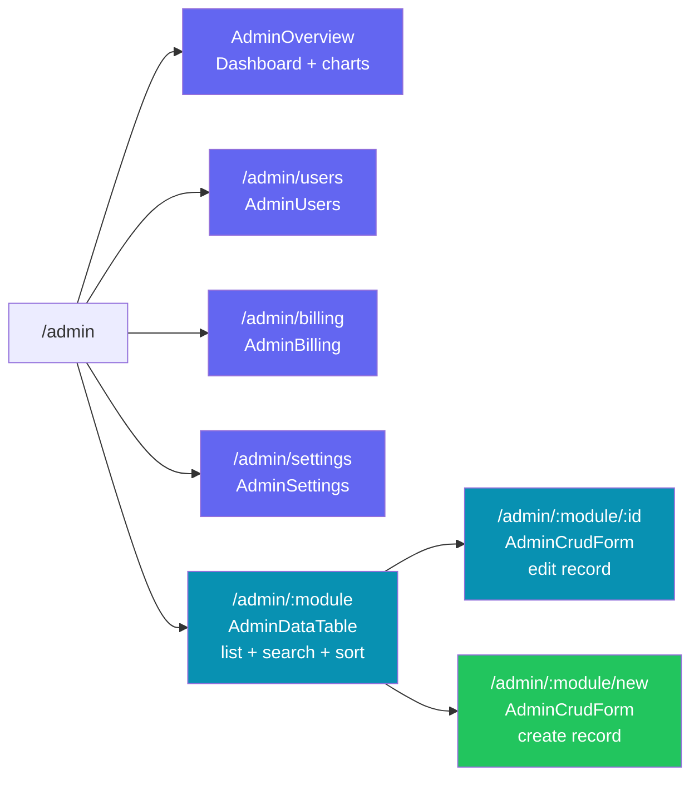
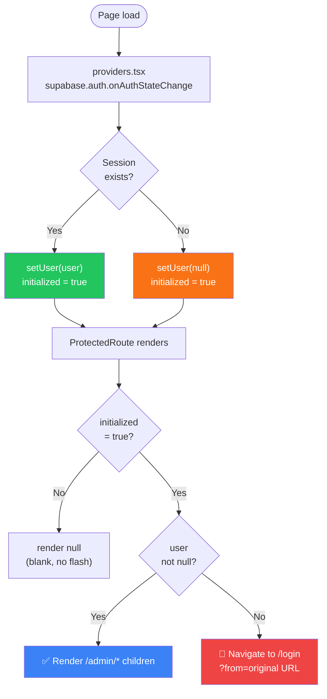
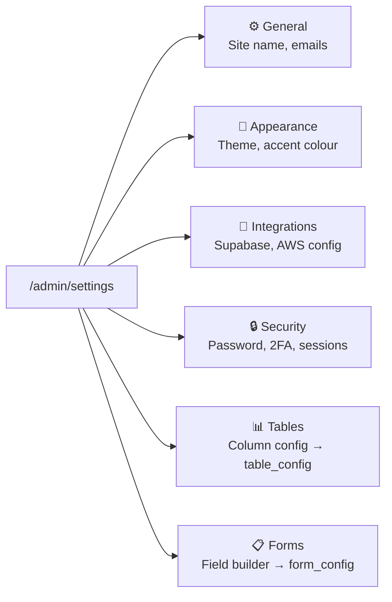

# Admin Panel — Overview

The admin panel is a full CMS for managing all website content. It lives at `/admin/*` and is protected by Supabase Auth.

---

## Route map



!!! important "Route ordering"
`users`, `billing`, and `settings` must be declared **before** the `:module` catch-all in `AdminDashboard.tsx`. Without this, React Router matches them as module names.

---

## Auth guard flow



---

## Settings tabs



---

## Key source files

```
src/
  pages/
    AdminDashboard.tsx       ← layout shell (sidebar + route switch)
    Login.tsx                ← email + password sign-in
  components/
    ProtectedRoute.tsx       ← auth guard
  features/admin/
    config/
      modules.tsx            ← MODULES array — all module + field definitions
    components/
      AdminSidebar.tsx       ← desktop sticky + mobile drawer nav
      AdminOverview.tsx      ← dashboard charts (Recharts)
      AdminDataTable.tsx     ← list table + search + sort + column config
      AdminCrudForm.tsx      ← dynamic form with all 12 field types
      AdminSettings.tsx      ← settings tabs + Tables/Forms builders
  lib/
    supabase.ts              ← Supabase client singleton
    imageUpload.ts           ← upload / replace / delete + moduleFolder()
  store/
    authSlice.ts             ← login / signOut thunks + user state
  app/
    providers.tsx            ← onAuthStateChange listener
```
