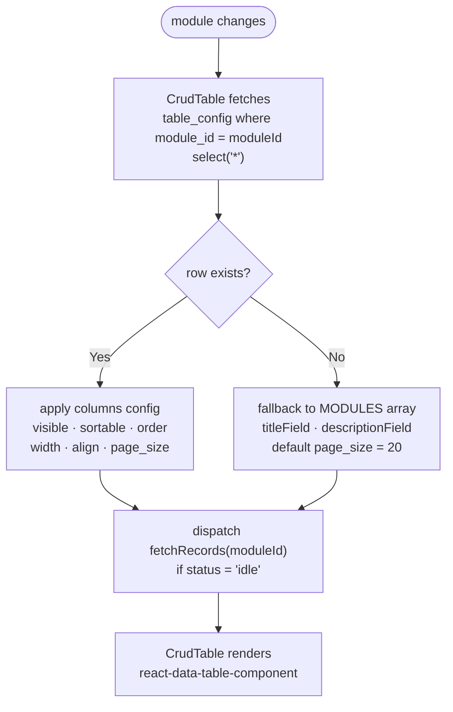

# Dynamic Table Column Config

The **Tables** tab in Admin Settings lets you customise each module's list table without touching code. Configuration is stored in Supabase and read by the `CrudTable` component at runtime.

---

## What you can configure per column

| Property   | Type              | Default | Description                                        |
| ---------- | ----------------- | ------- | -------------------------------------------------- |
| `field`    | string            | —       | **Required.** DB column key (e.g. `"title"`)       |
| `title`    | string            | —       | **Required.** Column header shown in the table     |
| `visible`  | boolean           | `true`  | Hide a column without removing it from config      |
| `sortable` | boolean           | `true`  | Enable/disable column sort click                   |
| `order`    | number            | —       | Display order — lower numbers appear first         |
| `width`    | string            | auto    | Fixed CSS width e.g. `"120px"` (omit = flex grow) |
| `height`   | string            | auto    | Fixed cell height e.g. `"48px"`                    |
| `align`    | left/center/right | left    | Cell and header text alignment                     |

### Per-table pagination

| Setting     | Type    | Default | Description                |
| ----------- | ------- | ------- | -------------------------- |
| `page_size` | integer | `20`    | Rows shown per page        |

`page_size` is a separate integer column on `table_config`. Add it with:

```sql
alter table table_config add column if not exists page_size integer;
```

Valid row-per-page options the user can switch to in the table footer: **10 / 20 / 50 / 100**.

---

## How to use (Settings UI)

1. Go to `/admin/settings` → **Tables** tab
2. Pick a module from the tabs at the top
3. Adjust label, visibility, sort, order, and alignment per column
4. Set **Rows per page** if you need a non-default value
5. Click **Save Changes**
6. The list table at `/admin/<module>` updates on next load

**Reset to defaults** restores the column config derived from the static `MODULES` definition.

---

## Storage (`table_config` table)

Each module config is a single row:

```sql
select * from table_config where module_id = 'projects';
```

```json
{
  "module_id": "projects",
  "page_size": 20,
  "columns": [
    { "field": "imageURL",    "title": "Cover",         "visible": true,  "sortable": false, "order": 0 },
    { "field": "title",       "title": "Project Name",  "visible": true,  "sortable": true,  "order": 1 },
    { "field": "service",     "title": "Service",       "visible": true,  "sortable": true,  "order": 2, "width": "140px" },
    { "field": "slug",        "title": "Slug",          "visible": true,  "sortable": true,  "order": 3, "width": "140px" },
    { "field": "description", "title": "Summary",       "visible": false, "sortable": false, "order": 4 },
    { "field": "is_top",      "title": "Featured",      "visible": true,  "sortable": true,  "order": 5, "width": "90px", "align": "center" }
  ]
}
```

Setting `visible: false` hides the column entirely. It still exists in the config and can be re-enabled later.

---

## Config load flow



---

## How `CrudTable` applies the config

`CrudTable` (`src/features/admin/components/CrudTable.tsx`) reads both column config and pagination from Supabase on module change:

```typescript
supabase
  .from('table_config')
  .select('*')
  .eq('module_id', moduleId)
  .maybeSingle()
  .then(({ data }) => {
    if (data?.columns)   setColConfig(data.columns as TableColumnConfig[]);
    if (data?.page_size) setPageSize(data.page_size as number);
  });
```

Columns are then built for `react-data-table-component`:

```typescript
[...colConfig]
  .filter((c) => c.visible !== false)
  .filter((c) => c.field.toLowerCase() !== primaryImgKey) // skip primary image (rendered separately)
  .sort((a, b) => (a.order ?? 0) - (b.order ?? 0))
  .forEach((c) => {
    const isImg = imageTypeKeys.has(c.field.toLowerCase());
    cols.push(
      isImg
        ? { id: c.field, name: c.title, width: c.width ?? '68px', sortable: false,
            cell: (row) => <ImageCell src={resolveImg(rowVal(row, c.field))} /> }
        : { id: c.field, name: c.title,
            selector: (row) => String(rowVal(row, c.field) ?? ''),
            sortable: c.sortable ?? true, wrap: true,
            ...(c.width ? { width: c.width } : { grow: 1 }) }
    );
  });
```

**Image handling notes:**
- `rowVal(row, key)` does a case-insensitive lookup — Postgres lowercases unquoted column names (e.g. `imageURL` → `imageurl`), so `field: "imageURL"` still resolves correctly
- Any column whose `field` matches an `image` or `images` type in `fields[]` is rendered as a thumbnail, not raw URL text
- The primary `imageField` is always the first column and is skipped in the colConfig loop to avoid duplication
- Clicking a row navigates to the edit form — there is no separate Edit button column

---

## Required Supabase table

```sql
create table if not exists table_config (
  id        bigint generated always as identity primary key,
  module_id text   not null unique,
  columns   jsonb  not null default '[]',
  page_size integer
);

alter table table_config enable row level security;

create policy "public read"
  on table_config for select using (true);

create policy "admin write"
  on table_config for all using (auth.role() = 'authenticated');
```

---

## TypeScript type reference

```typescript
// src/shared/types/tableConfig.ts

export interface TableColumnConfig {
  field: string;       // DB column key
  title: string;       // column header display name
  visible?: boolean;   // default true
  sortable?: boolean;  // default true
  order?: number;      // display order (ascending)
  width?: string;      // fixed width e.g. "120px"
  height?: string;     // fixed cell height e.g. "48px"
  align?: 'left' | 'center' | 'right';
}

export interface TableConfig {
  module_id: string;
  columns: TableColumnConfig[];
  page_size?: number;  // default 20
}
```
