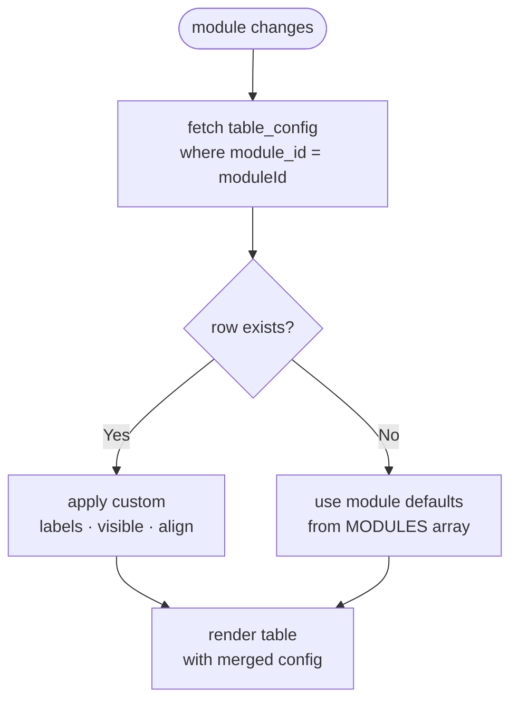

# Dynamic Table Column Config

The **Tables** section in Admin Settings lets you customise each module's list table without touching code.

---

## What you can configure per column

| Setting | Options               | Description                         |
| ------- | --------------------- | ----------------------------------- |
| Label   | free text             | Column header shown in the table    |
| Visible | on / off              | Hide a column without deleting it   |
| Align   | Left / Centre / Right | Text alignment for header and cells |

---

## How to use (Settings UI)

1. Go to `/admin/settings` → **Tables** tab
2. Pick a module from the tabs at the top
3. Adjust label, visibility, and alignment for each column
4. Click **Save Changes**
5. The list table at `/admin/<module>` updates immediately on next load

**Reset to defaults** restores the column config derived from the static `MODULES` definition.

---

## Storage (`table_config` table)

Each module config is stored as a single JSONB row:

```sql
select * from table_config where module_id = 'projects';
```

```json
{
  "module_id": "projects",
  "columns": [
    { "key": "imageurl", "label": "Cover", "visible": true, "align": "left" },
    {
      "key": "title",
      "label": "Project Name",
      "visible": true,
      "align": "left"
    },
    {
      "key": "description",
      "label": "Summary",
      "visible": false,
      "align": "left"
    }
  ]
}
```

Setting `visible: false` on the description column hides that column entirely from the table view.

---

## Config load flow



## How `AdminDataTable` applies the config

On module load, the table fetches the config:

```typescript
supabase
  .from('table_config')
  .select('columns')
  .eq('module_id', moduleId)
  .maybeSingle()
  .then(({ data }) => {
    if (data?.columns) setColConfig(data.columns);
  });
```

Then for each column it derives:

```typescript
const imgVisible =
  colConfig?.find((c) => c.key === mod.imageField)?.visible ?? true;
const titleLabel =
  colConfig?.find((c) => c.key === mod.titleField)?.label ?? 'Title';
const titleAlign =
  colConfig?.find((c) => c.key === mod.titleField)?.align ?? 'left';
```

If no config exists for the module, all defaults apply (visible, "Title" / "Description" labels, left-aligned).

---

## Required Supabase table

```sql
create table table_config (
  id        bigint generated always as identity primary key,
  module_id text   not null unique,
  columns   jsonb  not null default '[]'
);
alter table table_config enable row level security;
create policy "public read"  on table_config for select using (true);
create policy "admin write"  on table_config for all    using (auth.role() = 'authenticated');
```
