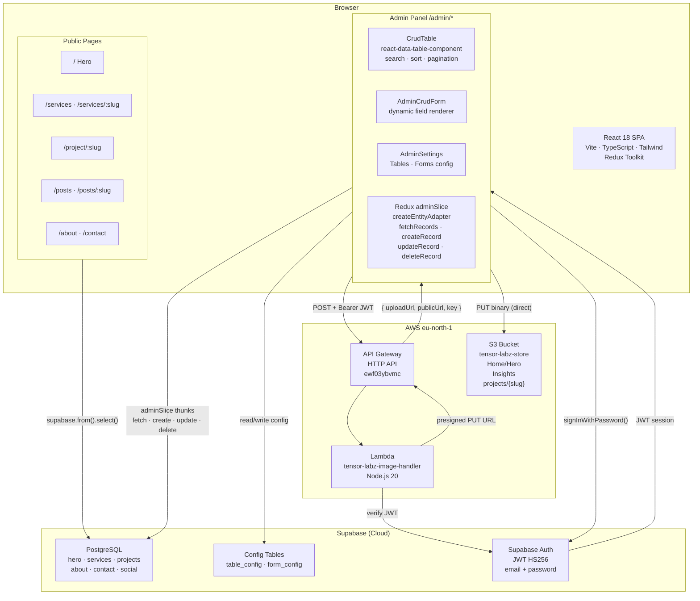
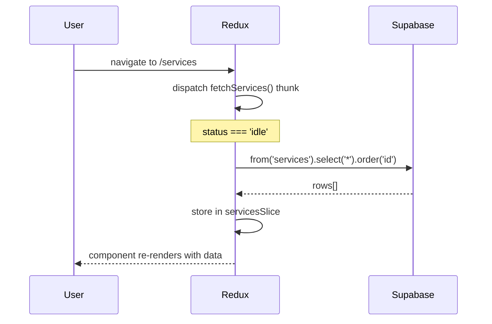
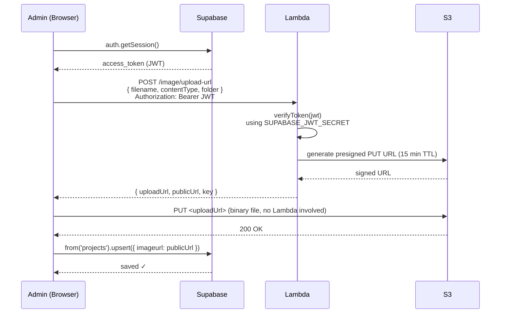
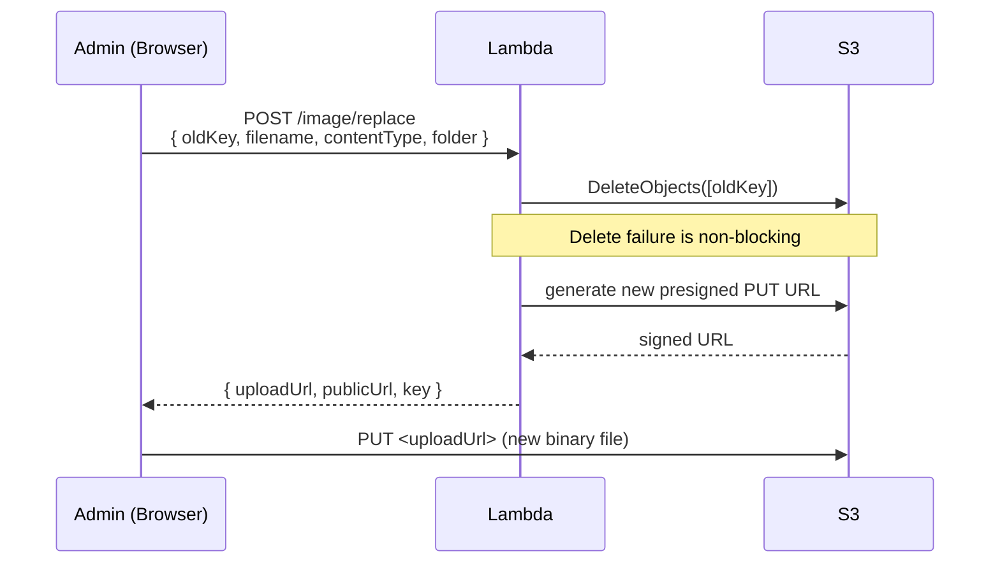
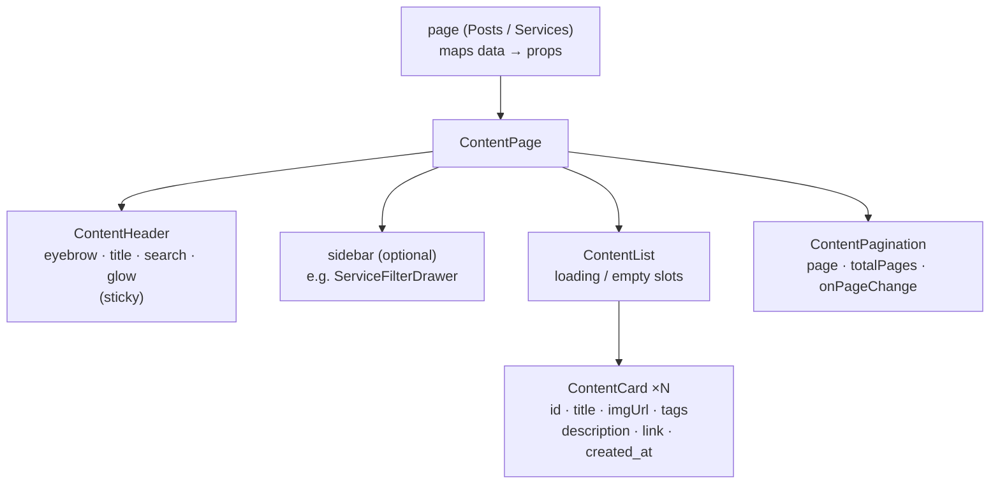
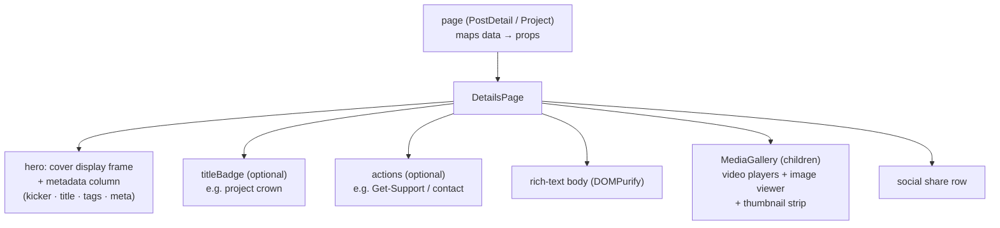

# System Architecture Overview

---

## Full system diagram

---

## Public page data flow

---

## Image upload flow

---

## Image replace flow (edit existing record)

---

## Frontend page composition

The list pages (posts, services) are built from one reusable, data-driven set in `src/shared/components/` — there are no per-page card/list/pagination/hero components.

| Component          | Role                                                                  |
| ------------------ | -------------------------------------------------------------------- |
| `ContentPage`      | Composes header + optional sidebar + list + pagination from props    |
| `ContentHeader`    | Sticky page header (search, glow); publishes height as `--page-header-h` |
| `ContentCard`      | Normalized content card; uniform height with image fill              |
| `ContentList`      | Vertical card list with loading/empty states                        |
| `ContentPagination`| Controlled prev/next + numbered paging                              |

- **Services page** is URL-driven: the active service comes from the route `:slug` (loads the correct list immediately on entry/refresh/back-forward), search uses `?q`, paging uses `?page`, and the filter is a left slide-in drawer in `ContentPage`'s `sidebar` slot. `/services` shows all; `/services/:slug` filters — no `/services/all` redirect.
- `ServiceCard` (home page service-category card) is separate from these content components.

### Detail pages

The single-item pages (post detail, project detail) share one composition the same way the list pages share `ContentPage`:

| Component     | Role                                                                       |
| ------------- | -------------------------------------------------------------------------- |
| `DetailsPage` | Detail composition: cover frame + metadata hero, body, share; optional `titleBadge` / `actions` / media `children` slots |
| `MediaGallery`| Generic media set (`MediaItem[]`) — videos + image viewer with thumbnails  |

- **`PostDetail`** feeds post data + `additional_media` into `MediaGallery`; cover supports image / YouTube / video (player embedded).
- **`Project`** reuses `DetailsPage` with the crown via `titleBadge`, Get-Support/contact via `actions`, and `extraImages` via `MediaGallery`.
- `coverThumbnail(url, type)` (`postService`) turns a YouTube cover link into a still thumbnail for list cards.

---

## Key design decisions

| Decision                              | Reason                                                           |
| ------------------------------------- | ---------------------------------------------------------------- |
| Supabase over Firestore               | Relational PostgreSQL — better for structured CMS with joins     |
| Lambda for S3 (not direct SDK)        | AWS credentials never in browser bundle                          |
| Supabase JWT for Lambda auth          | Single auth system — no second token service                     |
| Presigned PUT (browser → S3 direct)   | Lambda never handles binary — no 6 MB API Gateway limit          |
| Redux Toolkit                         | Consistent async state, memoized selectors, avoids prop drilling |
| Dynamic table/form config in Supabase | Schema changes without code deployments                          |
