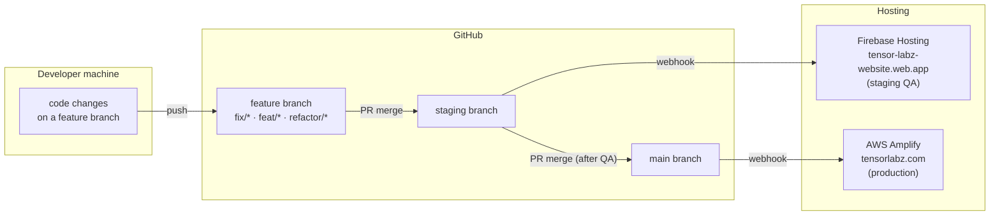
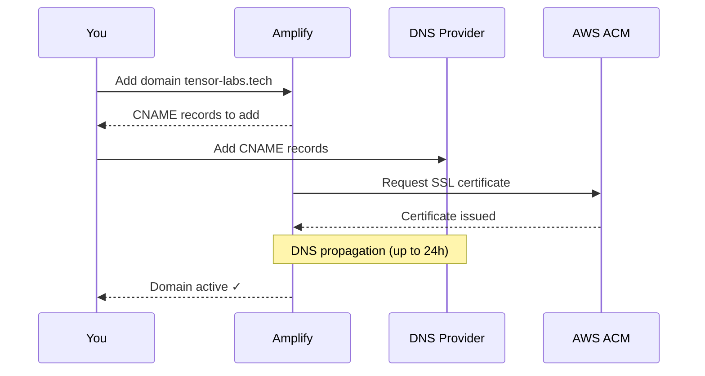

# Production Deployment — AWS Amplify

Production deploys automatically when code is pushed to the `main` branch.

| Item          | Value                   |
| ------------- | ----------------------- |
| Trigger       | Push to `main` branch   |
| Build command | `npm run build`         |
| Output        | `dist/`                 |
| CDN           | AWS CloudFront (global) |

---

## Branch strategy

```mermaid
gitGraph
   commit id: "initial setup"
   branch staging
   checkout staging
   branch feat/hero
   checkout feat/hero
   commit id: "feat: hero section"
   checkout staging
   merge feat/hero id: "PR: feat → staging"
   branch fix/mobile-nav
   checkout fix/mobile-nav
   commit id: "fix: mobile nav"
   checkout staging
   merge fix/mobile-nav id: "PR: fix → staging"
   branch main
   checkout main
   merge staging id: "PR: staging → main 🚀"
```

---

## Deploy pipeline



---

## Amplify environment variables

Add these in **Amplify Console → App → Environment variables** before the first build:

```
VITE_SUPABASE_URL
VITE_SUPABASE_ANON_KEY
VITE_IMAGE_LAMBDA_URL
VITE_CDN_URL
VITE_S3_BUCKET
VITE_S3_REGION
```

Update via CLI:

```bash
aws --profile tensor amplify update-app \
  --app-id <AMPLIFY_APP_ID> \
  --environment-variables \
    VITE_SUPABASE_URL=https://rsxbmgusdiilcajuoxmk.supabase.co,\
    VITE_SUPABASE_ANON_KEY=sb_publishable_...,\
    VITE_IMAGE_LAMBDA_URL=https://ewf03ybvmc.execute-api.eu-north-1.amazonaws.com,\
    VITE_CDN_URL=https://tensor-labz-store.s3.eu-north-1.amazonaws.com,\
    VITE_S3_BUCKET=tensor-labz-store,\
    VITE_S3_REGION=eu-north-1
```

After changing env vars, trigger a new Amplify build to pick them up.

---

## `amplify.yml` (build spec)

Create at repo root if Amplify cannot auto-detect the build:

```yaml
version: 1
frontend:
  phases:
    preBuild:
      commands:
        - npm ci
    build:
      commands:
        - npm run build
  artifacts:
    baseDirectory: dist
    files:
      - '**/*'
  cache:
    paths:
      - node_modules/**/*
```

---

## SPA routing fix

Add a rewrite rule in **Amplify Console → Rewrites and redirects**:

| Source | Target        | Type            |
| ------ | ------------- | --------------- |
| `/<*>` | `/index.html` | `200 (Rewrite)` |

Without this, refreshing any `/admin/*` URL returns 404.

---

## Custom domain (`tensor-labs.tech`)


