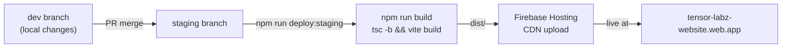
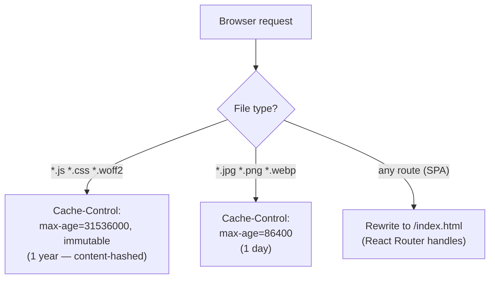

# Staging Deployment — Firebase Hosting

Staging is deployed to Firebase Hosting on every merge to the `staging` branch.

| Item             | Value                                                                      |
| ---------------- | -------------------------------------------------------------------------- |
| URL              | [https://tensor-labz-website.web.app](https://tensor-labz-website.web.app) |
| Firebase project | `tensor-labz-website`                                                      |
| Trigger branch   | `staging`                                                                  |

---

## Deploy flow



---

## Deploy manually

```bash
# From tensor-labz-website/
npm run deploy:staging
# Equivalent to: npm run build && firebase deploy --only hosting
```

---

## Caching strategy



---

## Firebase CLI setup (new machine)

```bash
# Install without sudo
npm config set prefix '~/.npm-global'
echo 'export PATH="$HOME/.npm-global/bin:$PATH"' >> ~/.bashrc
source ~/.bashrc
npm install -g firebase-tools

# Authenticate
firebase login                  # with browser
firebase login --no-localhost   # on headless server

# Verify
firebase projects:list
# should show: tensor-labz-website
```
