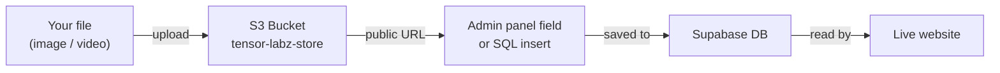

# S3 Upload & URL Guide

This guide covers how to manually upload files to the S3 bucket and use the resulting public URLs anywhere on the site — admin panel fields, Supabase SQL, or media gallery rows.

---

## How it works



Every file uploaded to the bucket gets a permanent public URL you can paste anywhere.

---

## Step 1 — Upload your file

Choose the method that fits your situation.

=== "AWS Console (easiest — no CLI needed)"

    1. Open [AWS Console → S3](https://s3.console.aws.amazon.com/s3/buckets/tensor-labz-store)
    2. Sign in with your IAM credentials
    3. Navigate to the correct folder (see [folder guide](#folder-guide) below)
    4. Click **Upload → Add files** and select your file
    5. Expand **Permissions** → tick **Grant public-read access**
    6. Click **Upload**

=== "AWS CLI (faster for multiple files)"

    **Single file:**

    ```bash
    aws --profile tensor s3 cp <your-file> s3://tensor-labz-store/<folder>/<filename> \
      --acl public-read \
      --content-type <mime-type>
    ```

    **Examples:**

    ```bash
    # Upload an About Us video
    aws --profile tensor s3 cp team-intro.mp4 \
      s3://tensor-labz-store/about-us/team-intro.mp4 \
      --acl public-read \
      --content-type video/mp4

    # Upload a hero slide image
    aws --profile tensor s3 cp hero-slide.jpg \
      s3://tensor-labz-store/Home/Hero/hero-slide.jpg \
      --acl public-read \
      --content-type image/jpeg

    # Upload the company logo
    aws --profile tensor s3 cp logo.png \
      s3://tensor-labz-store/assets/upload/logo.png \
      --acl public-read \
      --content-type image/png
    ```

    **Multiple files at once:**

    ```bash
    aws --profile tensor s3 sync ./my-images/ \
      s3://tensor-labz-store/projects/my-project/ \
      --acl public-read
    ```

---

## Step 2 — Get the public URL

The URL pattern is always:

```
https://tensor-labz-store.s3.eu-north-1.amazonaws.com/<folder>/<filename>
```

=== "AWS Console"

    1. Click the uploaded file in S3
    2. Copy the **Object URL** shown in the properties panel

=== "Build it yourself"

    Replace `<folder>` and `<filename>` with what you used:

    | Uploaded path | Public URL |
    | ------------- | ---------- |
    | `about-us/team-intro.mp4` | `https://tensor-labz-store.s3.eu-north-1.amazonaws.com/about-us/team-intro.mp4` |
    | `Home/Hero/hero-slide.jpg` | `https://tensor-labz-store.s3.eu-north-1.amazonaws.com/Home/Hero/hero-slide.jpg` |
    | `assets/upload/logo.png` | `https://tensor-labz-store.s3.eu-north-1.amazonaws.com/assets/upload/logo.png` |

---

## Step 3 — Use the URL

Where you paste the URL depends on what you're adding.

### Add to the About Us media gallery

**Via Supabase SQL editor** (fastest for one-off inserts):

```sql
-- Add a video
insert into about_media (type, url, title, sort_order) values
  ('video', 'https://tensor-labz-store.s3.eu-north-1.amazonaws.com/about-us/team-intro.mp4', 'Meet the Team', 3);

-- Add an image
insert into about_media (type, url, title, sort_order) values
  ('image', 'https://tensor-labz-store.s3.eu-north-1.amazonaws.com/about-us/office.jpg', 'Our Office', 4);
```

!!! tip "sort_order"
    Items are displayed in ascending `sort_order`. Set it to control the sequence.
    Use `1, 2, 3 …` or leave gaps (`10, 20, 30`) if you plan to insert items between existing ones later.

### Add a hero slide image

Go to **Admin → Hero Slides → New** or edit an existing slide and paste the URL into the **Image** field's **S3 / URL** tab.

Or directly via SQL:

```sql
insert into hero (title, subtitle, img) values
  ('AI for Agriculture', 'Building smarter tools for farmers',
   'https://tensor-labz-store.s3.eu-north-1.amazonaws.com/Home/Hero/hero-slide.jpg');
```

### Update the company logo

Go to **Admin → Settings → General** and paste the URL into the Logo URL fields.

Or via SQL:

```sql
update company_info set
  logo_url      = 'https://tensor-labz-store.s3.eu-north-1.amazonaws.com/assets/upload/logo.png',
  logo_url_dark = 'https://tensor-labz-store.s3.eu-north-1.amazonaws.com/assets/upload/logo-dark.png'
where id = 1;
```

### Add a project cover or extra images

In the admin panel: **Admin → Projects → edit project → Image** field → switch to **S3 / URL** tab → paste.

Or for extra images via SQL:

```sql
update projects
set extraimages = array[
  'https://tensor-labz-store.s3.eu-north-1.amazonaws.com/projects/my-project/img1.jpg',
  'https://tensor-labz-store.s3.eu-north-1.amazonaws.com/projects/my-project/img2.jpg'
]
where slug = 'my-project';
```

### Set a Google Maps embed for the Contact page

```sql
update contact
set link = 'https://www.google.com/maps/embed?pb=!1m17!1m12...'
where contact = 'address';
```

---

## Folder guide

Always place files in the right folder to keep the bucket organised.

| What you're uploading | Folder to use |
| --------------------- | ------------- |
| About Us videos / images | `about-us/` |
| Hero slide images | `Home/Hero/` |
| Service images | `Insights/` |
| Project cover + extras | `projects/{project-slug}/` |
| Company logo (light) | `assets/upload/logo.png` |
| Company logo (dark) | `assets/upload/logo-dark.png` |
| Any other static asset | `assets/upload/` |

---

## Supported file types

| Type | Extensions | Content-Type |
| ---- | ---------- | ------------ |
| Image | `.jpg`, `.jpeg` | `image/jpeg` |
| Image | `.png` | `image/png` |
| Image | `.webp` | `image/webp` |
| Image | `.gif` | `image/gif` |
| Image | `.svg` | `image/svg+xml` |
| Video | `.mp4` | `video/mp4` |
| Document | `.pdf` | `application/pdf` |

!!! warning "Keep files under 50 MB"
    Very large videos are best hosted on YouTube and added as embed URLs instead of S3 direct links. YouTube URLs also get automatic thumbnail previews in the media gallery.

---

## YouTube videos (no S3 upload needed)

For YouTube content, skip S3 entirely. Get the embed URL from YouTube and insert directly:

1. Open your video on YouTube
2. Click **Share → Embed**
3. Copy only the URL inside `src="..."` — e.g. `https://www.youtube.com/embed/dQw4w9WgXcQ`
4. Insert it into `about_media`:

```sql
insert into about_media (type, url, title, sort_order) values
  ('video', 'https://www.youtube.com/embed/dQw4w9WgXcQ', 'Our Story', 5);
```

The gallery automatically extracts a thumbnail from the YouTube video ID — no image upload needed.
