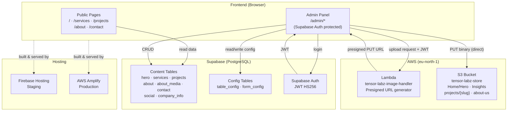

# Tensor Labz — Developer Documentation

Welcome to the complete developer documentation for the **Tensor Labz** website platform.

---

## System at a glance



---

## Tech stack

| Layer          | Technology                                      |
| -------------- | ----------------------------------------------- |
| Frontend       | React 18 + TypeScript + Vite + Tailwind CSS     |
| Animations     | Framer Motion (`motion/react`) + Three.js       |
| State          | Redux Toolkit                                   |
| CMS / Database | Supabase (PostgreSQL)                           |
| Auth           | Supabase Auth (JWT HS256)                       |
| Image Storage  | AWS S3 (`tensor-labz-store`, eu-north-1)        |
| Image Service  | AWS Lambda + API Gateway                        |
| Staging        | Firebase Hosting                                |
| Production     | AWS Amplify (auto-deploy from `main`)           |

---

## Quick links

| Resource             | Link |
| -------------------- | ---- |
| Frontend repo        | [tensor-labz/tensor-labz-website](https://github.com/tensor-labz/tensor-labz-website) |
| Lambda repo          | [tensor-labz/tensor-labz-image-lambda](https://github.com/tensor-labz/tensor-labz-image-lambda) |
| Supabase dashboard   | [rsxbmgusdiilcajuoxmk.supabase.co](https://supabase.com/dashboard/project/rsxbmgusdiilcajuoxmk) |
| AWS Console          | [eu-north-1 Lambda](https://eu-north-1.console.aws.amazon.com/lambda/home?region=eu-north-1) |
| Staging URL          | [tensor-labz-website.web.app](https://tensor-labz-website.web.app) |

---

## Branch strategy

```
feat/* ──► dev ──► staging ──► main
                     │              │
               Firebase          AWS Amplify
               (staging QA)      (production)
```

All development happens on `feat/*` branches → `dev`. When ready for QA, merge `dev → staging` (deploys to Firebase). When approved, merge `staging → main` (Amplify auto-deploys to production).

---

## Documentation sections

- **[Setup](setup/prerequisites.md)** — install tools, configure env vars, run locally
- **[Architecture](architecture/overview.md)** — full system diagram and data flow
- **[Supabase](supabase/schema.md)** — database schema, RLS, auth
- **[Lambda](lambda/overview.md)** — image service: how it works, how to deploy
- **[Admin Panel](admin/overview.md)** — CMS admin, modules, dynamic config
- **[Guides](guides/s3-upload-urls.md)** — S3 upload & URL workflow, admin CRUD operations
- **[Features](features/about-us.md)** — feature-level docs (About Us page, media gallery)
- **[Deployment](deployment/staging.md)** — staging (Firebase) and production (Amplify)
