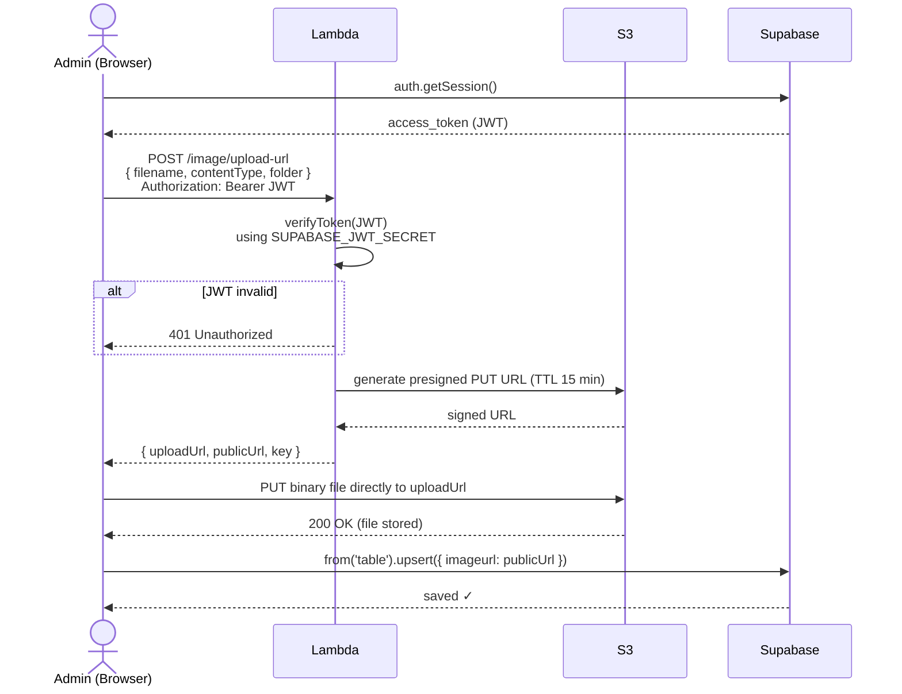
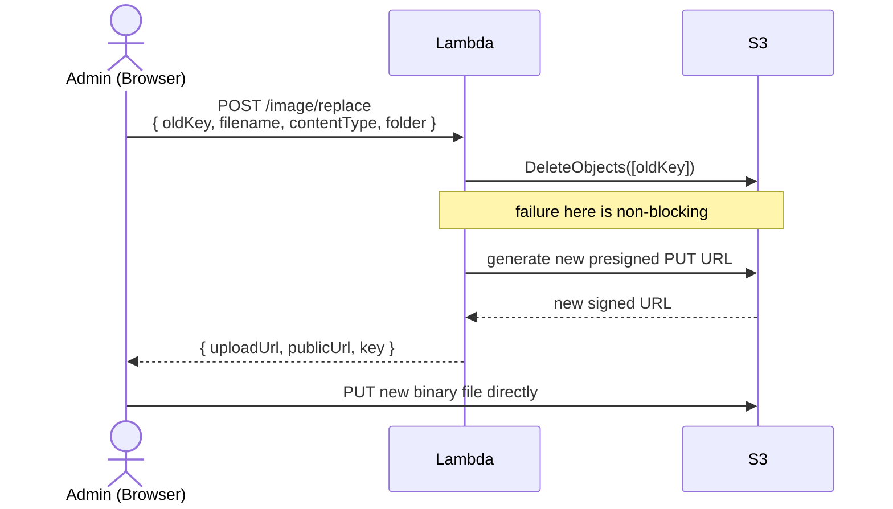
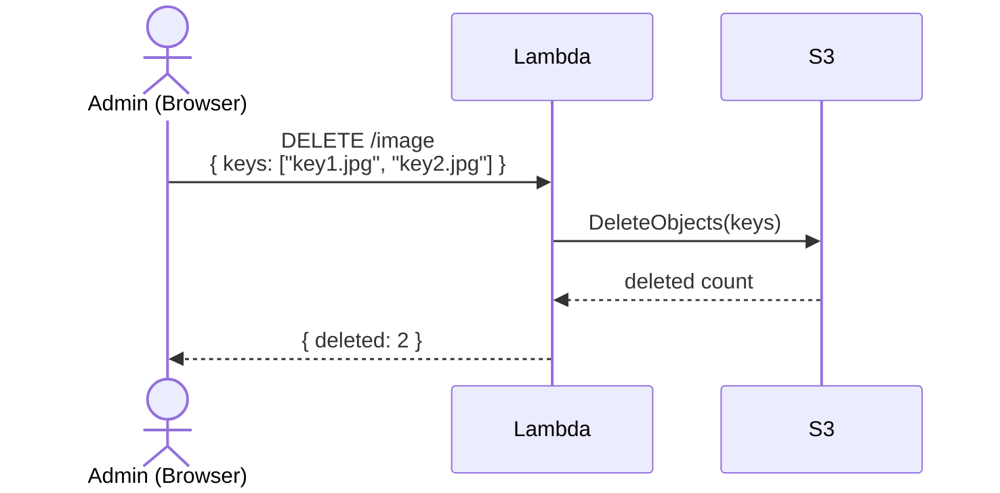
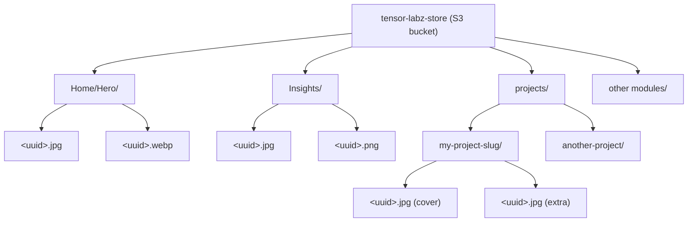
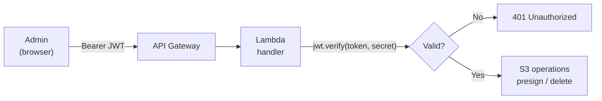

# Lambda Image Service — Overview

The **tensor-labz-image-handler** Lambda is a Node.js 20 service that acts as a secure proxy between the admin panel and AWS S3.

Repository: [ThanuMahee12/tensor-labz-image-lambda](https://github.com/ThanuMahee12/tensor-labz-image-lambda)

---

## Infrastructure

| Resource      | Value                                                     |
| ------------- | --------------------------------------------------------- |
| Function name | `tensor-labz-image-handler`                               |
| Runtime       | Node.js 20.x                                              |
| Region        | `eu-north-1`                                              |
| Memory        | 256 MB                                                    |
| Timeout       | 15 seconds                                                |
| API Gateway   | HTTP API — `ewf03ybvmc`                                   |
| Base URL      | `https://ewf03ybvmc.execute-api.eu-north-1.amazonaws.com` |
| S3 bucket     | `tensor-labz-store`                                       |
| IAM role      | `tensor-labz-lambda-exec`                                 |

---

## New image upload



---

## Replace existing image



---

## Delete image(s)



---

## S3 folder structure



The folder is determined by `moduleFolder()` in `src/lib/imageUpload.ts`:

```typescript
export function moduleFolder(moduleId: string, slug?: string): string {
  if (moduleId === 'hero') return 'Home/Hero';
  if (moduleId === 'services') return 'Insights';
  if (moduleId === 'projects') return `projects/${slug ?? 'draft'}`;
  return moduleId;
}
```

---

## Key source files

```
src/
  index.ts    ← main handler — routes POST/DELETE to auth + s3
  auth.ts     ← verifyToken() — validates Supabase JWT (HS256)
  s3.ts       ← createPresignedUrl(), deleteObjects(), urlToKey()
  types.ts    ← TypeScript interfaces for all request/response bodies
```

---

## Security model



- All three endpoints require a valid `Authorization: Bearer <jwt>` header
- JWT is verified using `SUPABASE_JWT_SECRET` (HS256 algorithm)
- Allowed MIME types: `image/jpeg`, `image/png`, `image/webp`, `image/gif`, `image/svg+xml`
- Presigned URLs expire after **15 minutes**
- CORS origin controlled by `ALLOWED_ORIGIN` env var
