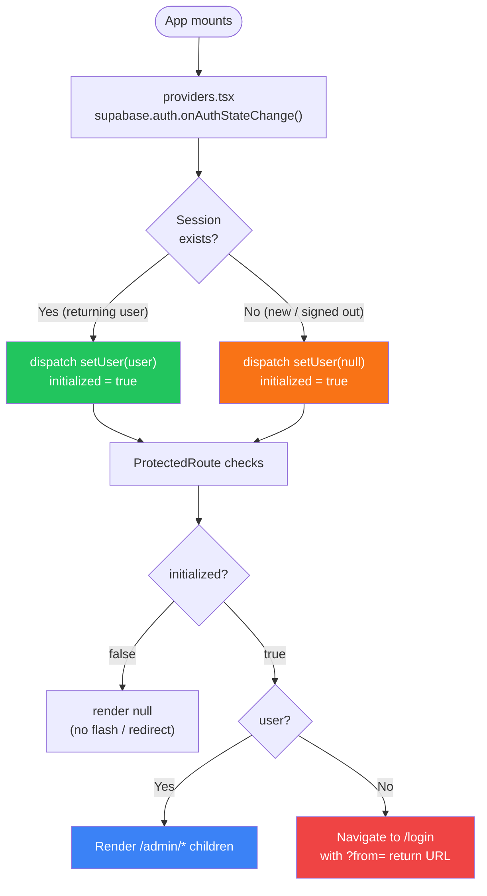
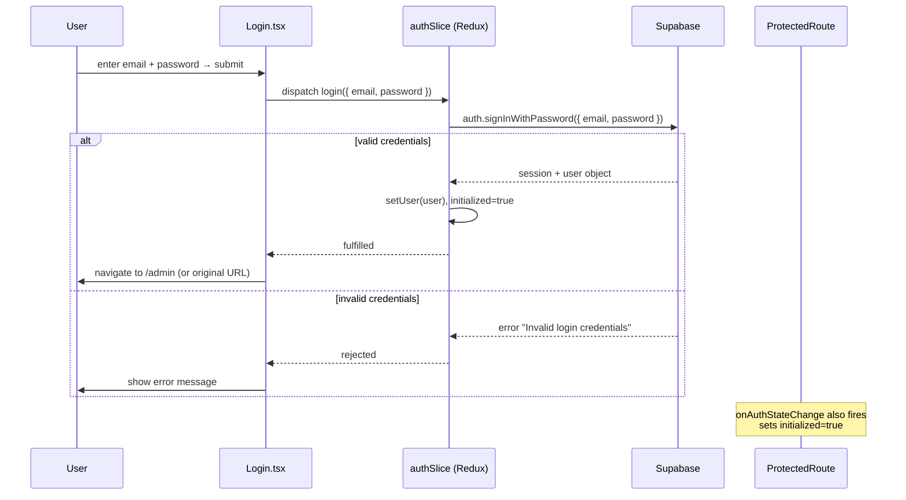
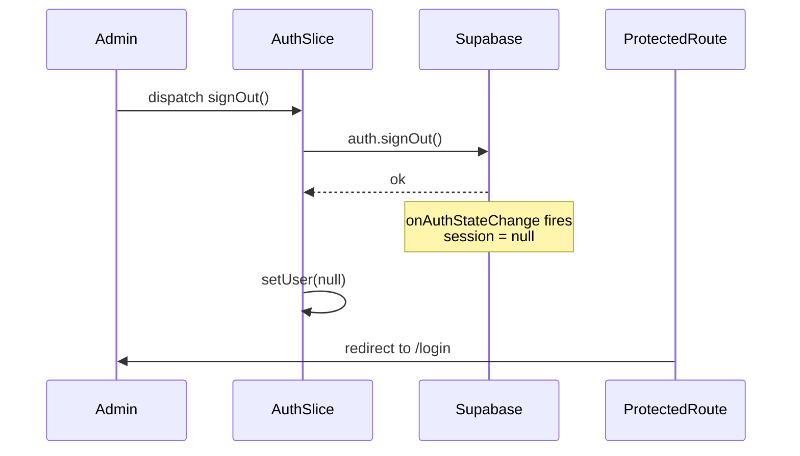
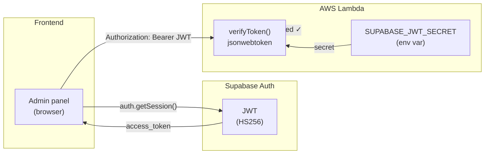

# Authentication

The admin panel is protected by **Supabase Auth** using email + password and JWT sessions.

---

## App startup auth flow

---

## Login sequence

---

## Sign-out flow

---

## JWT flow to Lambda

---

## Creating admin users

1. Go to **Supabase Dashboard → Authentication → Users**
2. Click **Invite user** and enter the email address
3. User receives a link to set their password
4. That email + password is used on the `/login` page

!!! warning "No self-registration"
There is no signup page. Admin users can only be created from the Supabase dashboard.

---

## Session persistence

Supabase stores the session in `localStorage`. On page reload:

1. `onAuthStateChange` fires with the existing session
2. `initialized` becomes `true` with the user set
3. `ProtectedRoute` renders the admin directly — no redirect
