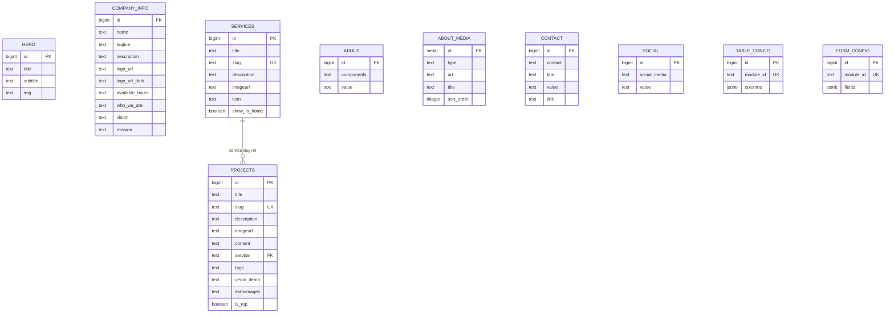

# Supabase Database Schema

Project URL: `https://rsxbmgusdiilcajuoxmk.supabase.co`

---

## Entity relationship diagram



---

## Full SQL — run once to create all tables

```sql
-- ──────────────────────────────────────────────
-- Hero slides
-- ──────────────────────────────────────────────
create table hero (
  id       bigint generated always as identity primary key,
  title    text not null,
  subtitle text,
  img      text
);

-- ──────────────────────────────────────────────
-- Company info (singleton row)
-- ──────────────────────────────────────────────
create table company_info (
  id              bigint generated always as identity primary key,
  name            text,
  tagline         text,
  description     text,
  logo_url        text,
  logo_url_dark   text,
  available_hours text,
  who_we_are      text,
  vision          text,
  mission         text
);

-- ──────────────────────────────────────────────
-- Services
-- ──────────────────────────────────────────────
create table services (
  id           bigint generated always as identity primary key,
  title        text    not null,
  slug         text    not null unique,
  description  text,
  imageurl     text,
  icon         text,
  show_in_home boolean not null default false
);

-- ──────────────────────────────────────────────
-- Projects
-- ──────────────────────────────────────────────
create table projects (
  id          bigint generated always as identity primary key,
  title       text    not null,
  slug        text    not null unique,
  description text,
  imageurl    text,
  content     text,
  service     text,
  tags        text,
  vedio_demo  text,
  extraimages text[],
  is_top      boolean not null default false
);

-- ──────────────────────────────────────────────
-- About Us — key facts grid
-- ──────────────────────────────────────────────
create table about (
  id         bigint generated always as identity primary key,
  components text not null,
  value      text
);

-- ──────────────────────────────────────────────
-- About Us — media gallery (videos + images)
-- ──────────────────────────────────────────────
create table about_media (
  id         serial primary key,
  type       text    not null default 'image',  -- 'video' | 'image'
  url        text    not null,                  -- S3 URL or YouTube embed URL
  title      text    default '',
  sort_order integer default 0
);

-- ──────────────────────────────────────────────
-- Contact details
-- ──────────────────────────────────────────────
create table contact (
  id      bigint generated always as identity primary key,
  contact text not null,  -- 'email' | 'phone' | 'address' | 'hours'
  title   text not null,
  value   text not null,
  link    text            -- optional explicit URL (e.g. Google Maps embed)
);

-- ──────────────────────────────────────────────
-- Social links
-- ──────────────────────────────────────────────
create table social (
  id           bigint generated always as identity primary key,
  social_media text not null,
  value        text not null
);

-- ──────────────────────────────────────────────
-- Admin: Table column configuration
-- ──────────────────────────────────────────────
create table table_config (
  id        bigint generated always as identity primary key,
  module_id text   not null unique,
  columns   jsonb  not null default '[]'
);

-- ──────────────────────────────────────────────
-- Admin: Form field configuration
-- ──────────────────────────────────────────────
create table form_config (
  id        bigint generated always as identity primary key,
  module_id text   not null unique,
  fields    jsonb  not null default '[]'
);
```

---

## Enable Row Level Security

```sql
alter table hero         enable row level security;
alter table company_info enable row level security;
alter table services     enable row level security;
alter table projects     enable row level security;
alter table about        enable row level security;
alter table about_media  enable row level security;
alter table contact      enable row level security;
alter table social       enable row level security;
alter table table_config enable row level security;
alter table form_config  enable row level security;
```

See [RLS Policies](rls-policies.md) for the full policy SQL.

---

## Sample data — `about_media`

Insert the initial media rows after creating the table:

```sql
insert into about_media (type, url, title, sort_order) values
  ('video', 'https://tensor-labz-store.s3.eu-north-1.amazonaws.com/about-us/aboutusBg.mp4',        'About Us',  1),
  ('image', 'https://tensor-labz-store.s3.eu-north-1.amazonaws.com/contact-us/ContactusBgLG.png',  'Our Story', 2);
```

**Adding a YouTube video:**

```sql
insert into about_media (type, url, title, sort_order) values
  ('video', 'https://www.youtube.com/embed/<VIDEO_ID>', 'Video title', 3);
```

!!! tip "YouTube thumbnails"
    The gallery automatically extracts a preview thumbnail from YouTube embed URLs using the video ID — no manual thumbnail upload needed.

---

## Column notes

### `contact.link`

The optional `link` column on the `contact` table holds an explicit URL that overrides auto-derived hrefs:

- For `contact = 'address'` rows, set `link` to a Google Maps embed URL (`https://www.google.com/maps/embed?pb=...`).
- The Contact Us page renders an `<iframe>` when the link contains `maps/embed`.

```sql
update contact
set link = 'https://www.google.com/maps/embed?pb=...'
where contact = 'address';
```

### `about_media.type`

| Value   | `url` format                                          | Thumbnail source            |
| ------- | ----------------------------------------------------- | --------------------------- |
| `image` | S3 public URL (`https://...s3...amazonaws.com/...`)   | Image itself                |
| `video` | S3 `.mp4` URL **or** YouTube embed URL                | YouTube: auto-extracted     |

### PostgreSQL identifier casing

PostgreSQL lowercases unquoted identifiers. `imageURL` → `imageurl` on disk.
The service layer maps these back:

```typescript
imageURL:    row.imageurl    ?? row.imageURL    ?? '',
extraImages: row.extraimages ?? row.extraImages ?? [],
```

### `table_config.columns` JSONB shape

```json
[
  { "key": "imageurl",     "label": "Image",       "visible": true,  "align": "left" },
  { "key": "title",        "label": "Title",        "visible": true,  "align": "left" },
  { "key": "description",  "label": "Description",  "visible": false, "align": "left" }
]
```

### `form_config.fields` JSONB shape

```json
[
  { "key": "title",  "label": "Title",  "type": "text",   "span": "half", "required": true },
  { "key": "status", "label": "Status", "type": "select", "span": "half",
    "options": ["Draft", "Published", "Archived"] }
]
```
