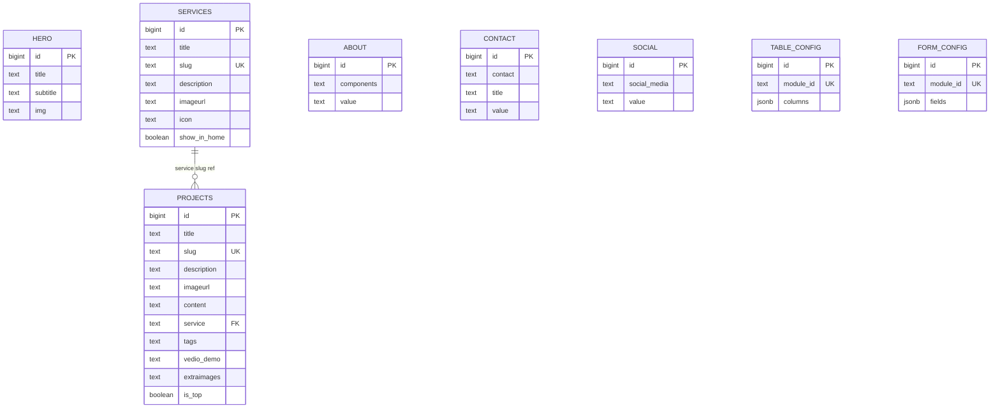

# Supabase Database Schema

Project URL: `https://rsxbmgusdiilcajuoxmk.supabase.co`

---

## Entity relationship diagram



---

## Full SQL — run once to create all tables

```sql
-- ──────────────────────────────────────────────
-- Hero slides
-- ──────────────────────────────────────────────
create table hero (
  id       bigint generated always as identity primary key,
  title    text not null,
  subtitle text,
  img      text   -- S3/CDN public URL
);

-- ──────────────────────────────────────────────
-- Services
-- ──────────────────────────────────────────────
create table services (
  id           bigint generated always as identity primary key,
  title        text    not null,
  slug         text    not null unique,
  description  text,
  imageurl     text,          -- S3/CDN public URL (PostgreSQL lowercases imageURL)
  icon         text,          -- CSS icon class or emoji
  show_in_home boolean not null default false
);

-- ──────────────────────────────────────────────
-- Projects
-- ──────────────────────────────────────────────
create table projects (
  id          bigint generated always as identity primary key,
  title       text    not null,
  slug        text    not null unique,
  description text,
  imageurl    text,           -- cover image S3/CDN URL
  content     text,           -- full HTML body
  service     text,           -- soft FK → services.slug
  tags        text,           -- comma-separated tag string
  vedio_demo  text,           -- YouTube embed URL (typo kept for DB compat)
  extraimages text[],         -- array of additional S3/CDN URLs
  is_top      boolean not null default false
);

-- ──────────────────────────────────────────────
-- About Us
-- ──────────────────────────────────────────────
create table about (
  id         bigint generated always as identity primary key,
  components text not null,   -- section/component name
  value      text             -- content / description
);

-- ──────────────────────────────────────────────
-- Contact Info
-- ──────────────────────────────────────────────
create table contact (
  id      bigint generated always as identity primary key,
  contact text not null,      -- type: "email" | "phone" | "address"
  title   text not null,      -- display label
  value   text not null       -- actual contact data
);

-- ──────────────────────────────────────────────
-- Social Links
-- ──────────────────────────────────────────────
create table social (
  id           bigint generated always as identity primary key,
  social_media text not null,  -- platform name
  value        text not null   -- full URL
);

-- ──────────────────────────────────────────────
-- Admin: Table column configuration
-- ──────────────────────────────────────────────
create table table_config (
  id        bigint generated always as identity primary key,
  module_id text   not null unique,
  columns   jsonb  not null default '[]'
);

-- ──────────────────────────────────────────────
-- Admin: Form field configuration
-- ──────────────────────────────────────────────
create table form_config (
  id        bigint generated always as identity primary key,
  module_id text   not null unique,
  fields    jsonb  not null default '[]'
);
```

---

## Enable Row Level Security

```sql
alter table hero         enable row level security;
alter table services     enable row level security;
alter table projects     enable row level security;
alter table about        enable row level security;
alter table contact      enable row level security;
alter table social       enable row level security;
alter table table_config enable row level security;
alter table form_config  enable row level security;
```

See [RLS Policies](rls-policies.md) for the full policy SQL.

---

## Column notes

### PostgreSQL identifier casing

PostgreSQL lowercases unquoted identifiers. `imageURL` becomes `imageurl` on disk.
The service layer maps these back:

```typescript
// projectsService.ts
imageURL:    row.imageurl    ?? row.imageURL    ?? '',
extraImages: row.extraimages ?? row.extraImages ?? [],

// servicesService.ts
service_name: row.title,
icon:         row.imageurl,
```

### `table_config.columns` JSONB shape

```json
[
  { "key": "imageurl", "label": "Image", "visible": true, "align": "left" },
  { "key": "title", "label": "Title", "visible": true, "align": "left" },
  {
    "key": "description",
    "label": "Description",
    "visible": false,
    "align": "left"
  }
]
```

### `form_config.fields` JSONB shape

```json
[
  {
    "key": "title",
    "label": "Title",
    "type": "text",
    "span": "half",
    "required": true
  },
  {
    "key": "status",
    "label": "Status",
    "type": "select",
    "span": "half",
    "options": ["Draft", "Published", "Archived"]
  }
]
```
